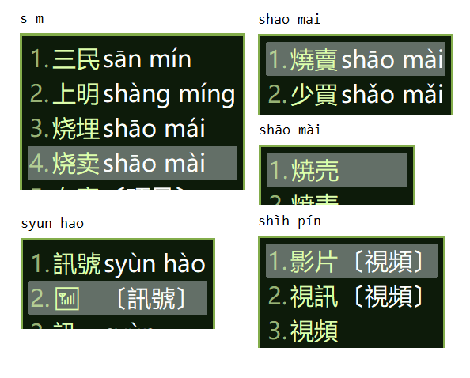

# rime-tongpin
TongYongPinYin schema for Rime IME.  
中州韻輸入法引擎華語通用拼音方案。  

## Features
* Show tones hint (For non-native speakers of Mandarin)
* Convert to emoji
* Output 台灣正體/日本新字体/简体
* Suggestion of Taiwanese Mandarin word.
* Use only 26 keys of the Latin alphabet (Include tones)
  * `q` = `1st tone`
  * `x` = `2nd tone`
  * `qq` = `3rd tone`
  * `v` = `4th tone`
  * `vv` = `5th tone`

## How to install
1. Install [Rime IME](https://rime.im/download/)
2. Copy the following files into your Rime user directory and redeploy:
    * tongpin.schema.yaml
    * tongpin.dict.yaml
    * tongpin.McBopomofo.dict.yaml
    * tongpin.user.dict.yaml
    * essay_tongpin.txt
    * opencc/*

    or if your environment can use plum: `lazyfoxchan/rime-tongpin`

  You can reference: [Rime 中的數據文件分佈及作用 (Rime IME project official documentation)](https://github.com/rime/home/wiki/RimeWithSchemata#rime-%E4%B8%AD%E7%9A%84%E6%95%B8%E6%93%9A%E6%96%87%E4%BB%B6%E5%88%86%E4%BD%88%E5%8F%8A%E4%BD%9C%E7%94%A8)

## License
See: [LICENSE.md](https://github.com/lazyfoxchan/rime-tongpin/blob/master/LICENSE.md)
